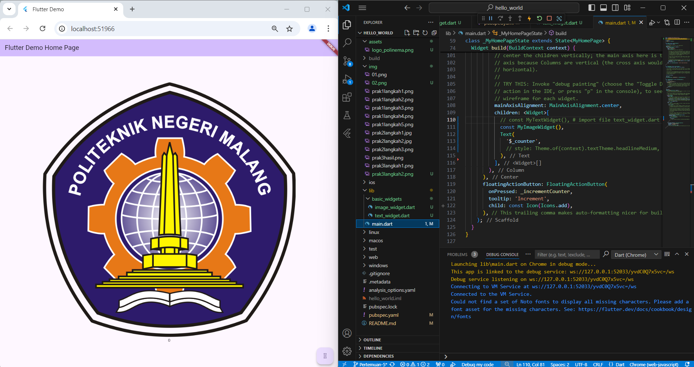
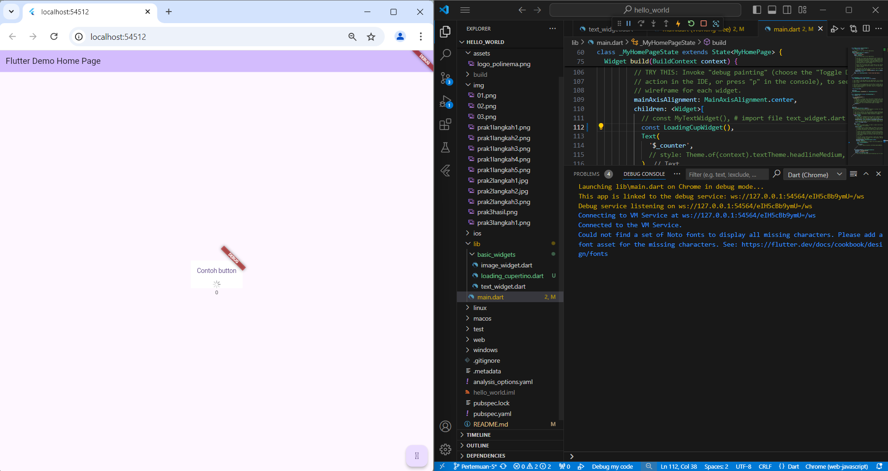
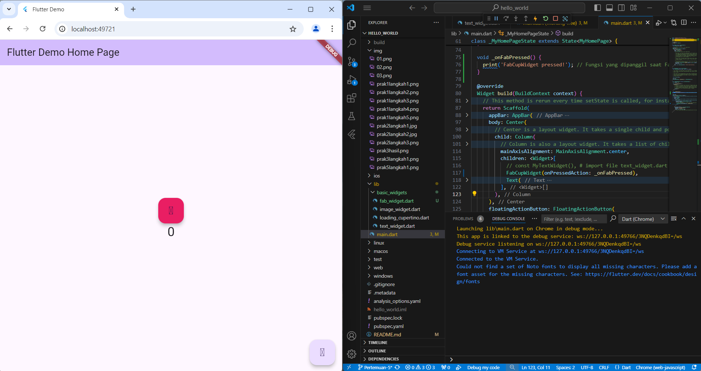
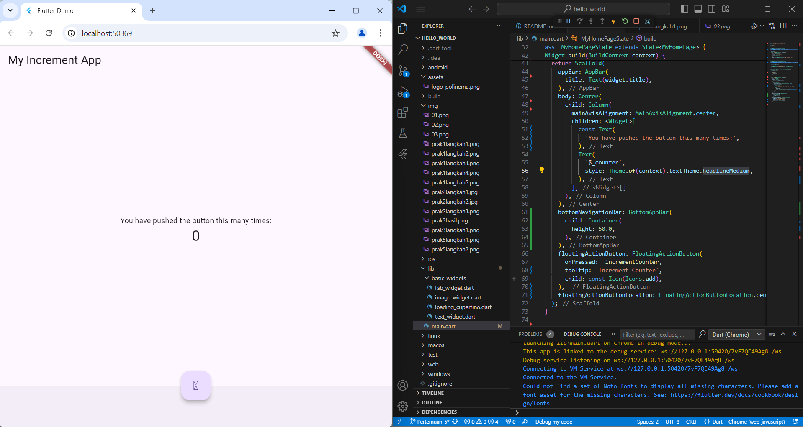
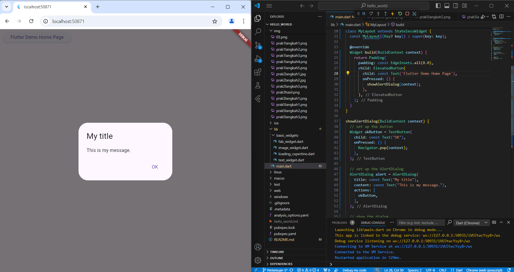
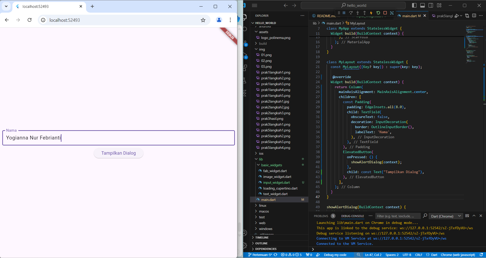

# **Laporan Praktikum Jobsheet 05 | Aplikasi Pertama dan Widget Dasar Flutter**
---

## Nama  : Yogianna Nur Febrianti
## Kelas : TI 3A
## Absen : 28
## NIM   : 2241720261
---

## Praktikum 1: Membuat Project Flutter Baru

### *- Langkah 1 :*


Pilih Flutter New Project lalu pilih Application

### *- Langkah 2 :*


Folder dibuat di C:\PemrogramanMobile

### *- langkah 3 :*


Project flutter hello_world 

### *- langkah 4 :*


Flutter Project is ready

## Praktikum 2: Menghubungkan Perangkat Android atau Emulator

### *- Langkah 1 :*


Sambungkan kabel USB pada perangkat ke laptop. Lalu, buka Developer options, scroll ke bawah ke bagian Debugging, lalu aktifkan USB debugging.

### *- Langkah 2 :*


Run main.dart pada windows dan tunggu prosesnya selesai

### *- Langkah 3 :*


Pada Handphone akan tampil program hello_world

## Praktikum 3: Membuat Repository GitHub dan Laporan Praktikum

### *- Langkah 11 :*


Menampilkan aplikasi flutter menggunakan browser Chrome

### *- Langkah 12 :*

Teks yang ditampilkan dalam aplikasi berupa nama lengkap Anda : *Yogianna Nur Febrianti*

### hello_world

A new Flutter project.


## Praktikum 4: Menerapkan Widget Dasar

### *- Langkah 1: Text Widget*

Buat folder basic_widgets di dalam folder lib, kemudian file di dalam basic_widgets dengan nama text_widget.dart, text didalam kode menggunakan nama : *Yogianna Nur Febrianti*

```dart
    import 'package:flutter/material.dart';

    class MyTextWidget extends StatelessWidget {
    const MyTextWidget({Key? key}) : super(key: key);

    @override
    Widget build(BuildContext context) {
        return const Text(
        "Nama saya Yogianna Nur Febrianti, sedang belajar Pemrograman Mobile",
        style: TextStyle(color: Colors.red, fontSize: 14),
        textAlign: TextAlign.center);
    }
    }
```

Import file text_widget.dart ke main.dart


### *- Langkah 2: Image Widget*

Buat sebuah file image_widget.dart di dalam folder basic_widgets

```dart
import 'package:flutter/material.dart';

class MyImageWidget extends StatelessWidget {
  const MyImageWidget({Key? key}) : super(key: key);

  @override
  Widget build(BuildContext context) {
    return const Image(
      image: AssetImage("assets/logo_polinema.png")
    );
  }
}
```

Penyesuaian asset pada file pubspec.yaml dan tambahkan file logo Anda di folder assets project hello_world.

```yaml
flutter:
  assets:
    - assets/logo_polinema.png
```

Import file image_widget.dart ke main.dart



## Praktikum 5: Menerapkan Widget Material Design dan iOS Cupertino

### *- Langkah 1: Cupertino Button dan Loading Bar*

File di basic_widgets > loading_cupertino.dart. Import stateless widget dari material dan cupertino. 



### *- Langkah 2: Floating Action Button (FAB)*

Button widget terdapat beberapa macam pada flutter yaitu ButtonBar, DropdownButton, TextButton, FloatingActionButton, IconButton, OutlineButton, PopupMenuButton, dan ElevatedButton.

File di basic_widgets > fab_widget.dart. Import stateless widget dari material. Lalu isi kode di dalam method Widget build



### *- Langkah 3: Scaffold Widget*

Scaffold widget digunakan untuk mengatur tata letak sesuai dengan material design.

Kode main.dart 



### *- Langkah 4: Dialog Widget*

Dialog widget pada flutter memiliki dua jenis dialog yaitu AlertDialog dan SimpleDialog.

Kode main.dart



### *- Langkah 5: Input dan Selection Widget*

Flutter menyediakan widget yang dapat menerima input dari pengguna aplikasi yaitu antara lain Checkbox, Date and Time Pickers, Radio Button, Slider, Switch, TextField.

File di basic_widgets > input_widget.dart. Import file input_widget.dart ke main.dart

