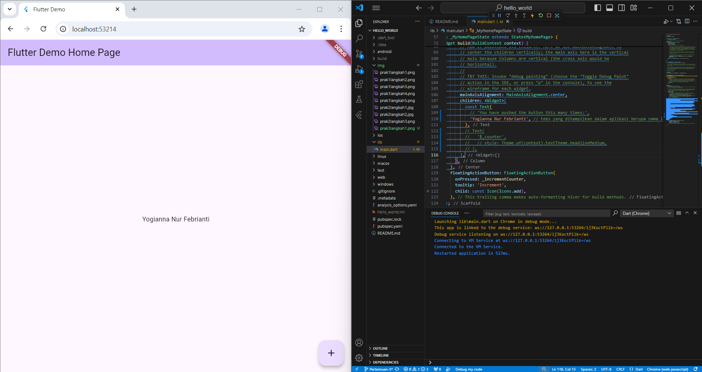
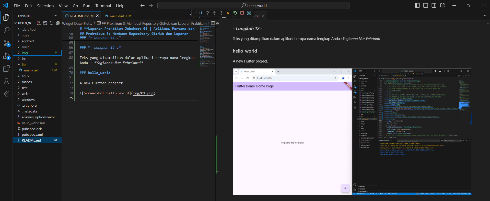

# **Laporan Praktikum Jobsheet 05 | Aplikasi Pertama dan Widget Dasar Flutter**
---

## Nama  : Yogianna Nur Febrianti
## Kelas : TI 3A
## Absen : 28
## NIM   : 2241720261
---

## Praktikum 1: Membuat Project Flutter Baru

### *- Langkah 1 :*

Pilih Flutter New Project lalu pilih Application

### *- Langkah 2 :*

Folder dibuat di C:\PemrogramanMobile

### *- langkah 3 :*

Project flutter hello_world 

### *- langkah 4 :*

Flutter Project is ready

## Praktikum 2: Menghubungkan Perangkat Android atau Emulator

### *- Langkah 1 :*

Sambungkan kabel USB pada perangkat ke laptop. Lalu, buka Developer options, scroll ke bawah ke bagian Debugging, lalu aktifkan USB debugging.

### *- Langkah 2 :*

Run main.dart pada windows dan tunggu prosesnya selesai

### *- Langkah 3 :*

Pada Handphone akan tampil program hello_world

## Praktikum 3: Membuat Repository GitHub dan Laporan Praktikum

### *- Langkah 11 :*

Menampilkan aplikasi flutter menggunakan browser Chrome

### *- Langkah 12 :*

Teks yang ditampilkan dalam aplikasi berupa nama lengkap Anda : *Yogianna Nur Febrianti*

### hello_world

A new Flutter project.

